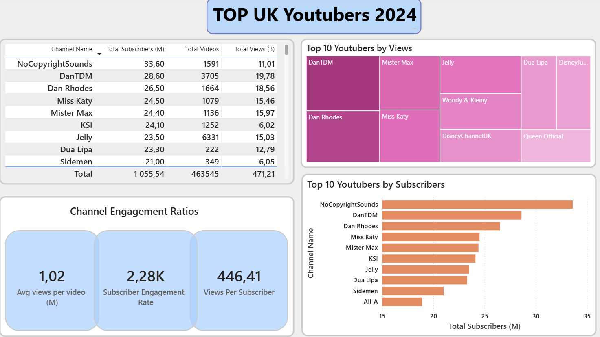

🎥 Top UK YouTubers 2024 Engagement Matrix

🚨 1. The Business Problem & Origin Story
Marketing executive teams and corporate brand managers struggle to maximize ROI when selecting influencer partnerships because they rely on surface-level vanity metrics. High subscriber counts frequently mask stagnant viewer engagement, unoptimized video production consistency, and declining audience retention rates. Relying on static listicles makes it impossible for companies to separate high-performing content engines from inefficient channels.

To solve this, I sourced a raw, uncurated global creator dataset from Kaggle, ingested it into a structured pipeline, cleaned formatting anomalies, and engineered a single-page corporate influencer benchmarking matrix using Power BI Desktop to isolate high-velocity creators and optimize marketing spend.

🎯 2. What Is Expected? (Strategic KPI Metrics)
The analytics panel features large-format high-contrast summary indicator tiles that baseline macro-level performance across the entire top-tier creator dataset:

• Total Audience Reach (Current Value: 1,055.54M): Establishes the macro-baseline for total addressable consumer subscriber impressions.
• Content Ecosystem Velocity (Current Value: 463,545 Videos): Aggregates global output to evaluate baseline channel longevity and historical consistency.
• Gross Historical Consumption (Current Value: 471.21B Views): Computes the aggregate lifetime media consumption footprint across the entire regional block.
• Average Content Impact (Current Value: 1.02M Views/Video): Switches the focus from vanity subscriber numbers to true per-upload performance baselines.

🛠️ 3. Action Taken: What I Did & How
I established an optimized data model and authored precise analytical measures utilizing DAX (Data Analysis Expressions) to dynamically compute relative performance multipliers across all channels:

💻 Primary DAX Formulas Implemented

A. Average Views Per Video (Millions)
Normalizes the core content consumption rate to filter out bias from sheer video volume output.
Avg Views Per Video (M) = 
DIVIDE(
    SUM('UK_YouTubers'[total_views]), 
    SUM('UK_YouTubers'[total_videos]), 
    0
) / 1000000000

B. Relative Subscriber Engagement Rate
Calculates audience response elasticity by scaling overall consumption activity against the subscriber baseline.
Subscriber Engagement Rate = 
DIVIDE(
    SUM('UK_YouTubers'[total_views]), 
    SUM('UK_YouTubers'[total_subscribers]), 
    0
) / 1000

C. Views Per Individual Subscriber Node
Determines the depth of historical audience retention and recurring content viewership per consumer profile.
Views Per Subscriber = 
DIVIDE(
    SUM('UK_YouTubers'[total_views]), 
    SUM('UK_YouTubers'[total_subscribers]), 
    0
)

🎛️ 4. Dynamic Data Filtering & Slicing
To allow marketing analysts to cross-reference multiple creator variables simultaneously, the interface relies on modular, responsive visuals:

• Channel Ranking Detail Grid: A multi-column master grid detailing individual metrics, enabling quick sorting by Total Subscribers, Total Videos, or Gross Views.
• View Volatility Treemap: A dynamic block-allocation chart representing the "Top 10 YouTubers by Views," visually emphasizing market-share concentration (e.g., DanTDM, Mister Max, Jelly).
• Audience Reach Horizontal Bar Chart: Tracks the "Top 10 YouTubers by Subscribers" to map subscriber density against actual view velocity.

💡 5. Executive Outcomes: Driving Insightful Decisions
This matrix transforms marketing campaign planning from guesswork into a data-driven science:

• Exposing Efficiency Outliers: Analysts can cross-reference channels like 'Dan Rhodes' (26.50M Subscribers / 18.56B Views) against 'NoCopyrightSounds' (33.60M Subscribers / 11.01B Views). Despite having fewer subscribers, Dan Rhodes delivers a massive consumption footprint, proving to be a much higher efficiency node for ad spend.
• Identifying Production Efficiency: Brands can evaluate content output health by identifying creators who secure hyper-engaged audiences with lower production overhead, protecting promotional budgets from over-indexing on low-view video mills.
• Strategic Campaign Alignment: Leadership can pivot between the high-volume visual Treemap and the engagement cards to immediately separate mass-reach channels from niche, high-retention fan bases.

♿ Inclusive Design & Accessibility Features
• Contrast Optimization: Styled with prominent, well-spaced white cards resting on a soft-grey background canvas to reduce eye fatigue during extended planning sessions.
• High-Impact Visual Hierarchy: Metrics utilize clear, oversized True Black font formatting paired with soft corporate pastel accent colors to guarantee immediate readability for executive leadership.
